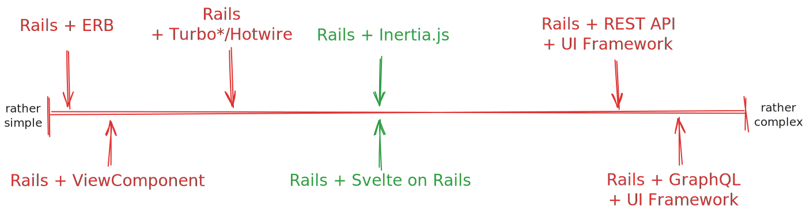
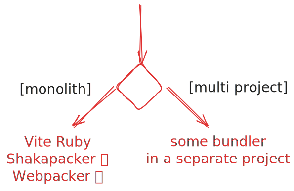
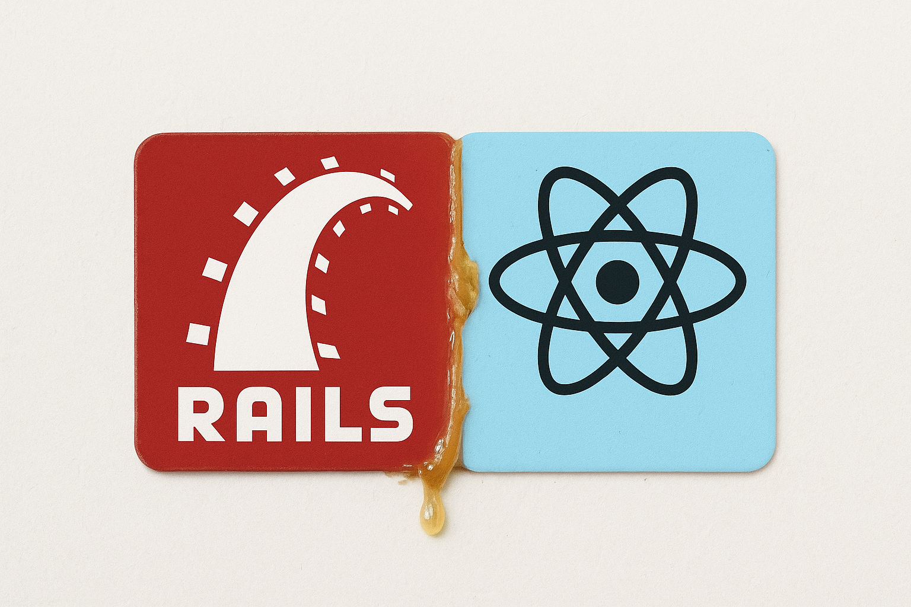
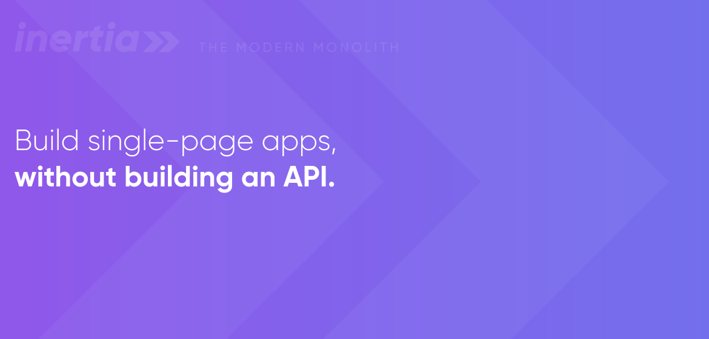
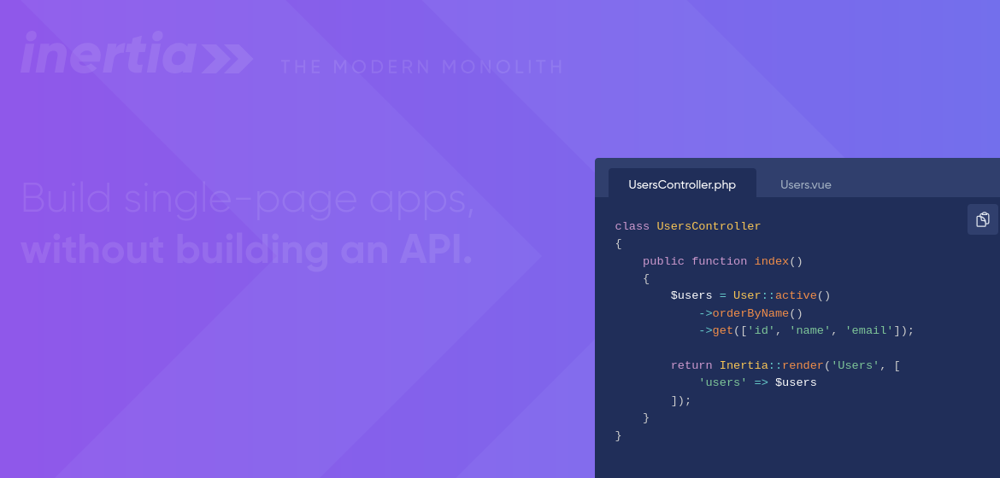

# Railshöck at openscript GmbH
10th of September 2025

---

# Agenda

1. **Intro** <br> by Robin Bühler
1. **Rails + Inertia.js** <br> by Diego Steiner
1. **5' Intermezzo "Netzwerk SDS"** <br> by Christian Sedlmair
1. **Rails + Svelte on Rails** <br> by Christian Sedlmair

---

# Front-end complexity

From a classic rails app to a modern PWA with a GraphQL API.




---
layout: two-cols-header
---

# Rails + ERB

::left::

- Established, well known and stable 🏛
- Server-side validation 🦺
- Many helpers (form helpers, etc.) 💪
- No additional dependencies, build steps, or complex deployment 🏃‍➡️
- No API required 🛠️
- Good UX can be hard to achieve 🥲
- Tedious to implement interactive elements 😶‍🌫️

::right::

- Difficult access to modern JS components 🧩

```erb
<%= render "application/header" %>

<h1>Products</h1>

<p>Here are a few of our fine products:</p>
<% @products.each do |product| %>
  <%= render partial: "product", locals: { product: product } %>
<% end %>

<%= link_to "Register", register_path %>

<%= render "application/footer" %>

```

---
layout: two-cols-header
---

# Rails + ViewComponent

https://viewcomponent.org

::left::

- Same pros and cons as Rails + ERB 💎
- Better encapsulation of components 🧱
- Easier to test partially 🧪

Add:

```rb
gem "view_component"
```

Then you can generate a component:

```rb
bin/rails generate view_component:component Example title
```

::right::

```rb
class ExampleComponent < ViewComponent::Base
  erb_template <<-ERB
    <span title="<%= @title %>"><%= content %></span>
  ERB

  def initialize(title:)
    @title = title
  end
end
```

```erb
<%= render(ExampleComponent.new(title: "my title")) do %>
  Hello, World!
<% end %>
```

---
layout: two-cols-header
---

# Rails + Turbo/Stimulus/Hotwire

- No API required when using Turbo 🛠️
- Modern, reactive UI with minimal JS when using Stimulus 💨
- Easy to deploy 🏃‍➡️
- Difficult to access to modern JS components 🧩

::left::

```html
<div data-controller="hello">
  <input data-hello-target="name" type="text">

  <button data-action="click->hello#greet">
    Greet
  </button>

  <span data-hello-target="output">
  </span>
</div>
```

::right::

```js
import { Controller } from "stimulus"

export default class extends Controller {
  static targets = [ "name", "output" ]

  greet() {
    this.outputTarget.textContent =
      `Hello, ${this.nameTarget.value}!`
  }
}
```
---
layout: two-cols-header
---

# Rails + API + UI Framework

::left::

- Clear separation of concerns 🧱
- Modern UI with a framework like React, Vue, Svelte, etc. 🎨
- Reusable API for other clients 📱
- More complex deployment and build steps 🏗️
- More dependencies to maintain 🧩
- Need to maintain an API 🛠️
- Client-side routing 🗺️
- Server-side rendering is hard 🥲

::right::



---
layout: two-cols-header
---

# Rails + Inertia.js

::left::

<div class="text-5xl text-center mt-10">?</div>

::right::

---
layout: two-cols-header
---

# Rails + Inertia.js

::left::


- Modern UI with a framework like React, Vue, Svelte, etc. 🎨
- No Reusable API 📱
- Server-side routing 🗺️
- Well integrated in established frameworks 🧩

::right::



<!-- Wir hatten einige Diskussionen wie wir unser Projekt umsetzten wollten. Wir verwenden gerne neue und uns noch unbekannte Technologien. Jedoch für dieses Projekt wollten wir uns schon ein bekannteren Tech-Stack annehmen.
Somit ergaben sich für uns einige Optionen wobei Inertia eigentlich noch nicht zur Auswahl Stand. Über ein Laravel + Vue Projekt, welches wir übernahmen, sind wir auf Inertia gestossen. -->

---
layout: cover
---

# So what is this «Inertia.js»?

---




<span v-click="3" class="text-[10rem] absolute top-20 right-30" >🥲</span>


<!--
Inertia claims:

1. be the «modern monolith» (it's not)
2. to «build SPAs without building an API»

It does this by «glueing» two frameworks together and replaces the view layer

3. e.g. Laravel

-->

---

# What is Inertia?

<v-clicks>

- *Server-side*: use prefered server-side frameworks with their its, controllers, auth, ...
  - **but without the view layer**
- *Client-side*: use prefered client-side frameworks with its component library, ...
  - **but without talking to a http-api**
- Glues these two sides together to build the «modern monolith»
- Created 2019 by Jonathan Reinink for Laravel

</v-clicks>


---

# What is Inertia?

- Many integrations available: [Community adapters](https://inertiajs.com/community-adapters)

<div class="flex justify-center text-5xl mt-5">
  <logos-rails v-click class="m-4 " />
  <logos-laravel v-click class="m-4 " />
  <logos-phoenix v-click class="m-4 " />
  <logos-django v-click class="m-4 " />
  <logos-spring v-click class="m-4 " />
</div>
<div v-click class="text-5xl text-center">+</div>
<div class="flex justify-center text-5xl">
  <logos-vue v-click class="m-4 " />
  <logos-react v-click class="m-4 " />
  <logos-svelte v-click class="m-4 " />
</div>

---

# How does Inertia work?

In a nutshell:

<v-clicks>

- Inertia «acts» as a client-side routing library
- Installs lightweight wrapper around anchor tags
- Intercepts clicks and makes visit via XHR
- Injects resulting props back into page components
- Initial view contains components and data

</v-clicks>

<v-click>

[Protocol Details](https://inertiajs.com/the-protocol)

</v-click>

---

# But that's just turbo with extra steps!?\*1!? 

<v-click>

*They do work in a similar way, however:*

Inertia relies on a **client-side framework** for rendering and has good integrations

</v-click>


---
layout: cover
---

# [Intertia in action](http://localhost:3000)

with:

- **Rails** as backend framework
- **React** as frontend framework
- **Mantine** as component framework 

---
layout: two-cols-header
---

## Inertia setup

::left::

__Inertia.ts__

```ts {all|2|5-11|13-15|all}
createInertiaApp({
  title: (title) => (title ? `${title} - ICT BLJ DocPortal` : "ICT BLJ DocPortal"),

  resolve: (name) => {
    const pages = import.meta.glob<ResolvedComponent>("../pages/**/*.tsx", {
      eager: true,
    });
    const page = pages[`../pages/${name}.tsx`];
    if (!page) {
      console.error(`Missing Inertia page component: '${name}.tsx'`);
    }

    if (page.default?.layout === undefined) {
      page.default.layout = (page: ReactNode) => AppShell({ children: page });
    }

    return page;
  }
});
```

::right::

<span :class="$slidev.nav.clicks === 2 ? 'text-red-600' : ''">**Home**</span>**.tsx**

```tsx {all|1,5-7|3-10|none|all}{at: +1}
import { Head, Link } from "@inertiajs/react";

const Home = ({ username }: { username: string }) => (
  <>
    <Head>
      <title>Home</title>
    </Head>
    <h1>Welcome {username}</h1>;
  </>
);

export default Home;

```

<!-- Das Grundsetup und die Installation überspringen wir da es gut dokumentiert ist und auch Projektspezifisch ist. Stattdessen zeigen wir eine Grundkonfiguration des Inertia.ts files. -->

---
layout: two-cols-header
---

## Controllers

::left::

__schools_controller.rb__

```rb {all|5|6-8|all}
  def index
    @schools = @filter.apply(School.all)
    @pagination, @records = pagy(@schools, page:)

    render inertia: "school/Schools", props: {
      schools: SchoolSerializer.render_as_hash(@records, view: :show_view),
      filter: @filter.attributes,
      pagination: PaginationSerializer.render_as_hash(@pagination)
    }
  end
```

::right::

<span :class="$slidev.nav.clicks === 1 ? 'text-red-600' : ''">**school/Schools**</span>**.tsx**

```tsx {all|10|1-10|all}{at: +1}
type SchoolsProps = {
  schools: School[];
  filter: {
    sort_key?: "bms" | "title" | "short";
    sort_direction?: "asc" | "desc";
  };
  pagination: Pagination;
};

export default function Schools({ schools, filter, pagination }: SchoolsProps) {
...
}
```
---

## Shorthand routing

__routes.rb__

```rb{all|2-6|8-9|all}
Rails.application.routes.draw do
  # Within resource definitions
  resources :users do
    get :activity, on: :member
    get :statistics, on: :collection
  end

  # Basic usage - maps 'dashboard' URL to 'Dashboard' component
  inertia 'dashboard' => 'Dashboard'

  # Within namespaces and scopes
  namespace :admin do
    inertia 'dashboard' => 'Admin/Dashboard'
  end
end
```
---
layout: two-cols-header
---

## Links

::left::

__As anchor__

```tsx {all|1,8|all}
import { Head, Link } from "@inertiajs/react";
import type { ReactNode } from "react";

const Home = ({ username }: { username: string }) => {
  return (
    <>
      <nav>
        <Link href="/">Home</Link>
      </nav>
      <h1>Welcome {username}</h1>
    </>
  );
};
```

<Link class="text-sm" href="jsroutes">See also: path helpers with js-routes</Link>

::right::

<v-clicks>
<div>

**As button**
```tsx {all|8|all}{at: +4}
import { Head, Link } from "@inertiajs/react";
import type { ReactNode } from "react";

const Home = ({ username }: { username: string }) => {
  return (
    <>
      <nav>
        <Link href="/" as="button">Home</Link>
      </nav>
      <h1>Welcome {username}</h1>
    </>
  );
};
```

</div>
</v-clicks>

---
hide: true
---

### Other options for links

* method (`GET|POST|PUT|PATCH|DELETE`)
* data (POST, PUT data)
* headers
* replace (Browser History ersetzten statt hinzufügen)
* preserveState (nicht komplett neu rendern)
* preserveScroll
* only (Partial Reloading)

---

## Manual routing

```ts
import { router } from '@inertiajs/react';

router.visit(url, options);
```
or more specific:
```ts
router.get(url, data, options);
router.post(url, data, options);
router.put(url, data, options);
router.patch(url, data, options);
router.delete(url, options);
router.reload(options);
```

__Example__
```ts
router.post("/login", {
  email: "max.muster@example.org",
  password: "password"
});
```
---

## Event callbacks

```ts
router.visit(url, {
  onBefore: (visit) => {},
  onStart: (visit) => {},
  onProgress: (progress) => {},
  onSuccess: (page) => {},
  onError: (errors) => {},
  onCancel: () => {},
  onFinish: (visit) => {}
});
```

__Example__

```ts
router.post("/login",
    {
      email: "max.muster@example.org",
      password: "password",
    },
    {
      onSuccess: (page) => console.log(page.props.message), // implement flash message in frontend
    },
);
```
---
hide: true
---

## More fun stuff

__Browser history__
```ts
router.push(options);
router.replace(options)
```

__Abort request__

```ts
router.post('/users', data, {
  onCancelToken: (cancelToken) => this.cancelToken = cancelToken,
});

this.cancelToken.cancel();
```
---
hide: true
---

## Other options for the router

```ts
router.visit(url, {
  method: 'get',
  data: {},
  replace: false,
  preserveState: false,
  preserveScroll: false,
  only: [],
  except: [],
  headers: {},
  errorBag: null,
  forceFormData: false,
  queryStringArrayFormat: 'brackets',
  async: false,
  showProgress: true,
  fresh: false,
  reset: [],
  preserveUrl: false,
  prefetch: false,
  onPrefetching: () => {},
  onPrefetched: () => {},
});
```
---
routeAlias: jsroutes
---

## JS routes

```bash
rake js:routes
```

__AdminCreate.tsx__

```ts
import { admins_path } from "../../../routes";
import { type RequestPayload, router } from "@inertiajs/core";

export default function AdminCreate() {
  const onSubmit = (values: RequestPayload) => router.post(admins_path(), values);
}
```
---
hide: true
---

## Generated routes

__routes.d.ts__
```ts
/**
 * Generates rails route to
 * /admins(.:format)
 * @param {object | undefined} options
 * @returns {string} route path
 */
export const admins_path: ((
  options?: {format?: OptionalRouteParameter} & RouteOptions
) => string) & RouteHelperExtras;
```

---
layout: two-cols-header
---

## Feature ⭐ Client-side partial loading

::left::

__ApprenticeCreate.tsx__

```ts{none|all|2|all}
router.reload({
  only: ["groups"],
  data: {
    selected_year_context_id: yearContextId,
    selected_occupation: occupation
  },
});
```

::right::

__apprentices_controller.rb__

```rb{none|all|3|4|all}{at: +1}
render inertia: "users/apprentice/ApprenticeCreate", props: {
  ...
  groups: -> { GroupSerializer.render_as_hash(@groups || []) },
  other_prop: Inertia.optional { "I wont be evaluated" }
  ...
}
```

---

### Client-side partial loading

__Exclude__

```ts
router.reload({
  except: ["groups"]
});
```

__As link__

```tsx
<Link href="/groups" only={['groups']}>Gruppen Anzeigen</Link>
```

__specific properties__
```ts
router.reload({
  only: ["user.firstname", "user.lastname"],
});
```

---
layout: two-cols-header
---

### Server-side partial loading

__All options__

```rb
# ALWAYS on standard visits
# OPTIONAL on partial reloads
# ALWAYS evaluated
users: User.all,

# ALWAYS on standard visits
# OPTIONAL on partial reloads
# CONDITIONALLY evaluated
users: -> { User.all },

# NEVER on standard visits
# OPTIONAL on partial reloads
# CONDITIONALLY evaluated
users: InertiaRails.optional { User.all },

# ALWAYS on standard visits
# ALWAYS on partial reloads
# ALWAYS evaluated
users: InertiaRails.always { User.all },
```
---
layout: two-cols-header
---

## Recipe 👨‍🍳 server-side validations

::left::

__application_controller.rb__

```rb{none|all|6-7|all}
def create
  ...
  if admin.save
    redirect_to admins_path
  else
    redirect_to new_admin_path,
     inertia: { errors: admin.errors }
  end
end
```

::right::

__AdminForm.tsx__

```ts{none|all|1,3-6,9-10|all}{at: +1}
import { usePage } from "@inertiajs/react";

type FormErrors = {
  first_name?: string[];
  last_name?: string[];
};

export function AdminForm() {
  const { errors } =
    usePage<{ errors: FormErrors }>().props;
}
```

---
layout: two-cols-header
---

## Feature ⭐ Shared data

::left::

__application_controller.rb__

```rb{none|all|2-8|2-8|all}
class ApplicationController < ActionController::Base
 inertia_share do
    {
      flash: InertiaRails.always do
       flash&.to_hash.presence || nil
      end
    }
  end
end
```

::right::

__admins_controller.rb__

```rb{none|all|4|all}{at: +1}
def create
  ...
  if admin.save
    flash[:notice] = "Admin successfully created"
    redirect_to admins_path
  else
    redirect_to new_admin_path, inertia: { errors: admin.errors }
  end
end
```
---
layout: two-cols-header
---

## Feature ⭐ Deferred Props

::left::

__items_controller.rb__
```rb{none|all|2|all}
render inertia: "Items/Items", props: {
      items: InertiaRails.defer { @items },
      params: @params
}
```

::right::

__Items.tsx__
```tsx{none|all|1,5-9|all}{at: +1}
import { Deferred } from "@inertiajs/react";

export default function Items({ items, params }: ItemsProps) {
  return (
    <Deferred data="items"
      fallback={<ItemsTable loading />}>
      <ItemsTable items={items}
       onDelete={deleteItem}/>
    </Deferred>
  )
}
```
---

<div class="flex justify-center">
  <SlidevVideo controls class="w-[80%] h-auto">
    <source src="./assets/DeferredPropsDemo.mp4" type="video/mp4" />

     <p>
      Your browser does not support videos. You may download it
      <a href="./assets/DeferredPropsDemo.mp4">here</a>.
    </p>
  </SlidevVideo>
</div>
---
---

## Grouping defered props

```rb{none|all|2|3-4|all}
render inertia: "Items/Items", props: {
      items: InertiaRails.defer { @items },
      params: InertiaRails.defer('attributes') { @params },
      filters: InertiaRails.defer('attributes') { @filters },
}
```
---
layout: two-cols-header
---

## Feature ⭐ Merging props

::left::

__items_controller.rb__

```rb{none|all|2-4,6}
def index
  Item.offset(params["offset"] || 0)
      .limit(20)
      .order(:id)
  render inertia: "Items/ItemsIndex", props: {
    items: InertiaRails.merge { @items.as_json() },
  }
end
```

::right::

__Items.tsx__

```tsx{none|all|3-5|all}{at: +1}
const loadMoreRecords = () => {
  setLoading(true);
  router.reload({
    only: ["items"],
    data: { offset: items.length },
    onFinish: () => setLoading(false)
  });
}
```
---

<div class="flex justify-center">
  <SlidevVideo controls class="w-[80%] h-auto">
    <source src="./assets/MergePropsDemo.mp4" type="video/mp4" />
    <p>
      Your browser does not support videos. You may download it
      <a href="./assets/MergePropsDemo.mp4">here</a>.
    </p>
  </SlidevVideo>
</div>

---

## Reset merged props

```tsx{all|4-5|all}
const onReset = () => {
  setLoading(true)
  router.reload({
    reset: ["items"],
    data: { offset: 0 },
    onFinish: () => setLoading(false)
  });
}
```
---

## Feature ⭐ Prefetching

__Navbar.tsx__

```tsx
<>
  <NavLink component={Link} href="/items/new" label="New Item" prefetch />
  <NavLink component={Link} href="/items" label="Items" prefetch cacheFor="5s" />
</>
```

__More options__

```tsx
<Link prefetch="click" />
<Link prefetch="mount" />
<Link prefetch={["mount", "hover"]} />
// Cache is stale between 5s - 60s
<Link prefetch cacheFor={["5s", "1m"]}>
```

---

<div class="flex justify-center">
  <SlidevVideo controls class="w-[80%] h-auto">
    <source src="./assets/Prefetching.mp4" type="video/mp4" />

     <p>
      Your browser does not support videos. You may download it
      <a href="./assets/Prefetching.mp4">here</a>.
    </p>
  </SlidevVideo>
</div>

---

## Feature ⭐ Forms

- Inertia supports forms, but we went with mantine's forms and used the router to post data back to rails

---
hide: true
---

## Feature ⭐ Forms

```tsx

import { useForm } from '@inertiajs/react'

const { data, setData, post, processing, errors } = useForm({
  email: '',
  password: '',
})

return (
  <form onSubmit={() => {e.preventDefault(); post('/login')}}>
    <input type="text" value={data.email}
      onChange={(e) => setData('email', e.target.value)}
    />
    {errors.email && <div>{errors.email}</div>}
    <input type="password" value={data.password}
      onChange={(e) => setData('password', e.target.value)}
    />
    {errors.password && <div>{errors.password}</div>}
    <button type="submit" disabled={processing}>
      Login
    </button>
  </form>
)

```
<!-- Optional kann man das auch auslassen da wir keine Erfahrung mit diesen Forms gemacht haben -->

---
layout: two-cols-header
---

# Conclusion

::left::

## Liked ❤️

<v-clicks>

- Seamless integration in Rails and React
- Simplicity and ease of use
- Wide adoption and support for many usecases

</v-clicks>


::right::

## Nitpicks 💩

<v-clicks>

- Some interactions are hard (e.g. modal dialogs)
- Types for TS are not generated by the backend

</v-clicks>


---
layout: cover
---

our conclusion:

## perfect 5/7, would use again!\*

<small v-click>*) for small projects that dont need an api</small>
